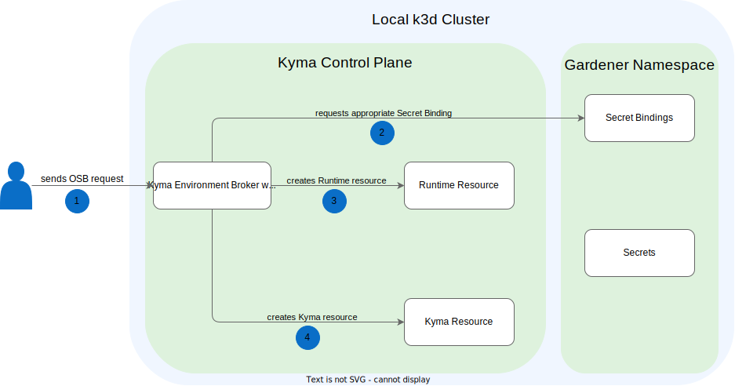

# Install the Kyma Environment Broker Locally

## Local Architecture



The diagram illustrates the architecture based on an example provisioning request.
1. The user sends a provisioning request.
2. KEB requests an appropriate Secret Binding.
3. KEB creates a Runtime resource.
4. KEB creates a Kyma resource.

## Prerequisites

* [kubectl](https://kubernetes.io/docs/tasks/tools/install-kubectl/)
* Kubernetes cluster, or [k3d](https://k3d.io) for local installation
* [yq](https://github.com/mikefarah/yq)

## Procedure

1. To install Kyma Environment Broker, use one of the following commands:

    ```bash
    make install
    ```

    ```bash
    make install VERSION=1.18.0
    ```

    ```bash
    make install VERSION=PR-1980
    ```
   
2. Before performing any operation on the instance, port forward the necessary services to your local machine:

   ```bash
   kubectl port-forward -n kcp-system deployment/kcp-kyma-environment-broker 8080:8080 5432:5432
   ```

3. To provision the instance, use the following command. Note that this is an example of a command you can use for instance provisioning.

   ```bash
   curl --request PUT \
   --url http://localhost:8080/oauth/v2/service_instances/azure-cluster \
   --header 'Content-Type: application/json' \
   --header 'X-Broker-API-Version: 2.16' \
   --data '{
      "service_id": "47c9dcbf-ff30-448e-ab36-d3bad66ba281",
      "plan_id": "4deee563-e5ec-4731-b9b1-53b42d855f0c",
      "context": {
         "globalaccount_id": "2f5011af-2fd3-44ba-ac60-eeb1148c2995",
         "subaccount_id": "8b9a0db4-9aef-4da2-a856-61a4420b66fd",
         "user_id": "user@email.com"
      },
      "parameters": {
         "name": "azure-cluster",
         "region": "northeurope"
      }
   }'
   ```

4. To simulate Kyma Infrastructure Manager and transition the runtime to the `Ready` state, use the following command:

   ```bash
   make set-runtime-state RUNTIME_ID=<runtime_id> STATE=Ready
   ```

5. To simulate Lifecycle Manager and transition the Kyma to the `Ready` state, use the following command:

   ```bash
   make set-kyma-state KYMA_ID=<kyma_id> STATE=Ready
   ```

6. To update the instance, use the following command. Note that this is an example of a command you can use for instance updating.

   ```bash
   curl --request PATCH \
   --url http://localhost:8080/oauth/v2/service_instances/azure-cluster?accepts_incomplete=true \
   --header 'Content-Type: application/json' \
   --header 'X-Broker-API-Version: 2.16' \
   --data '{
      "service_id": "47c9dcbf-ff30-448e-ab36-d3bad66ba281",
      "plan_id": "4deee563-e5ec-4731-b9b1-53b42d855f0c",
      "context": {
         "globalaccount_id": "2f5011af-2fd3-44ba-ac60-eeb1148c2995",
         "subaccount_id": "8b9a0db4-9aef-4da2-a856-61a4420b66fd",
         "user_id": "user@email.com"
      },
      "parameters": {
         "machineType": "Standard_D4s_v5"
      }
   }'
   ```

7. To deprovision the instance, use the following command. Note that this command can only work if you have used the command provided in this document to create the instance.

   ```bash
   curl --request DELETE \
   --url http://localhost:8080/oauth/v2/service_instances/azure-cluster?accepts_incomplete=true&service_id=47c9dcbf-ff30-448e-ab36-d3bad66ba281&plan_id=4deee563-e5ec-4731-b9b1-53b42d855f0c \
   --header 'Content-Type: application/json' \
   --header 'X-Broker-API-Version: 2.16' \
   --data '{
      "service_id": "47c9dcbf-ff30-448e-ab36-d3bad66ba281",
      "plan_id": "4deee563-e5ec-4731-b9b1-53b42d855f0c",
      "context": {
         "globalaccount_id": "2f5011af-2fd3-44ba-ac60-eeb1148c2995",
         "subaccount_id": "8b9a0db4-9aef-4da2-a856-61a4420b66fd",
         "user_id": "user@email.com"
      }
   }'
   ```

### Kyma Control Plane (KCP) CLI

To list, filter, and observe runtimes and their various attributes and states using the KCP CLI, set the `keb-api-url` to `http://localhost:8080` in the KCP configuration file.
